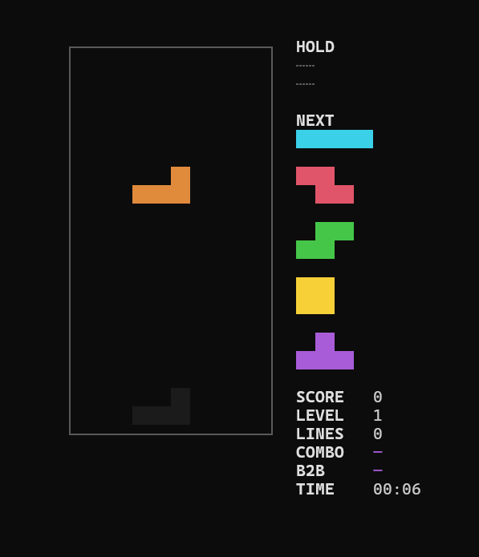
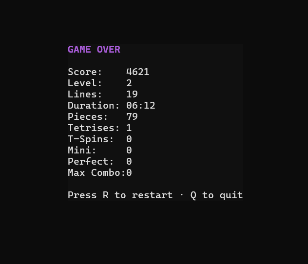
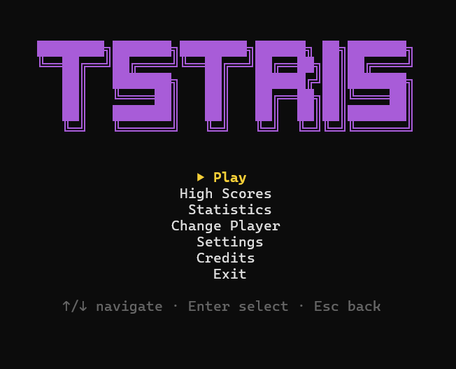

# Tetris

A production-quality Tetris game implemented in **Go** with terminal and
WebAssembly editions. It follows the modern **Tetris Guideline** as closely as
practical, with SRS wall kicks, a 7-bag randomizer, T-spins, combos,
back-to-back chains, perfect clears, leaderboards, and lifetime statistics.

```
+------------------------+   +--------------------------+
|        NEXT            |   | SCORE   0                |
|          ██             |   | LEVEL   1                |
|        ██████           |   | LINES   0                |
|                        |   | COMBO   —                |
+------------------------+   | B2B     —                |
                           | TIME    00:00              |
+------------------------+   +--------------------------+
|        ████            |
|        ████            |
|                    ▒▒▒▒ |
|        ████    ▒▒▒▒██ |
|        ████    ██████ |
+------------------------+
```

## Screenshots

| Game Board                              | Game Over                              | Menu / Options                        |
| --------------------------------------- | -------------------------------------- | ------------------------------------- |
|            |             |       |

## Features

- **7 Tetrominoes** with official colors, spawn positions, and rotation states.
- **7-Bag Randomizer** — even piece distribution, never repeats before a bag empties.
- **Super Rotation System (SRS)** with standard JLSTZ and I wall/floor kick tables,
  plus optional 180° rotation.
- **Hold piece** (once per piece), **ghost piece**, and a **5-piece next queue**.
- **Lock delay** with move/rotate resets (extended rule, 15 resets).
- **Gravity** curve per level, **soft drop** (+1/cell) and **hard drop** (+2/cell).
- **T-Spin detection** (mini / full × single / double / triple) via the 3-corner rule.
- **Combos**, **Back-to-Back** bonuses, and **Perfect Clear** detection.
- **Guideline scoring** with level multiplier, combo, B2B, and PC bonuses.
- **Line-clear animation** and **pause / game-over overlays**.
- **Auto-centered UI** that scales its block size to fill the terminal nicely.
- **Four themes**: Classic, Neon, Retro Green, Monochrome.
- **Persistence** via SQLite: player profiles, games, high scores (top 20), and
  aggregated statistics.
- **Menus**: Play, High Scores, Statistics, Change Player, Settings, Credits.
- **Configurable** settings (starting level, ghost, hold, 180°, theme, FPS, key
  bindings) persisted to `settings.json`.

## Requirements

- Go 1.21 or newer.
- A terminal that supports ANSI colors and Unicode (Windows Terminal, iTerm2,
  GNOME Terminal, etc.).
- No C compiler required — SQLite is the pure-Go `github.com/glebarez/sqlite`
  driver.

## Build

```bash
go build -o tetris ./cmd/tetris
```

## Run

```bash
./tetris            # or: go run ./cmd/tetris
```

On first launch you will be prompted for a username (a profile is created
automatically if it does not exist). Select **Play** to begin.

## Play in the browser (WebAssembly)

The same engine runs in any modern browser — no terminal required. The game
logic (`internal/domain`) compiles to WebAssembly and is rendered to a
`<canvas>`; high scores are kept in `localStorage`.

The game is deployed automatically to **GitHub Pages** from the
`.github/workflows/pages.yml` workflow on every push to `main`. After the
first run, enable it in **Settings → Pages → Build and deployment → Source:
GitHub Actions**; the published URL (e.g. `https://<user>.github.io/<repo>/`)
is playable by anyone.

### Run locally

```bash
# 1. Build the WASM binary + copy the JS glue (needs Go installed)
cp "$(go env GOROOT)/lib/wasm/wasm_exec.js" web/
GOOS=js GOARCH=wasm go build -o web/main.wasm ./cmd/wasm

# 2. Serve the folder over HTTP (wasm will not load from file://)
cd web && python3 -m http.server 8080
#    then open http://localhost:8080
```

### Browser controls

| Action      | Keyboard            | Touch gesture                    |
| ----------- | ------------------- | -------------------------------- |
| Move        | Left / Right        | Drag horizontally                |
| Soft Drop   | Down (hold)         | Drag down                        |
| Hard Drop   | Space               | Flick down                       |
| Rotate CW   | Up                  | Tap the right half               |
| Rotate CCW  | Z                   | Tap the left half                |
| Rotate 180  | A                   | Double-tap either half           |
| Hold Piece  | C                   | Swipe up                         |
| Pause       | P                   | Tap the corner pause control     |
| Restart     | R                   | Use Restart in the pause screen  |

The playfield itself is the touch controller; there is no gameplay button
panel. The layout keeps the field, hold/next previews, HUD, and pause control in
one viewport in portrait and landscape orientations.

The browser includes Marathon, 40-line Sprint, two-minute Ultra, and Zen modes;
per-mode leaderboards and personal bests; full-interface themes; sound and
haptic feedback; gesture sensitivity; reduced motion; high contrast; and
expanded lifetime statistics. Browser data is persisted in `localStorage`.

> **Trademark:** Tetris® is a registered trademark of Tetris Holding, LLC.
> This project is a fan-made clone and is not affiliated with or endorsed by
> The Tetris Company.

## Controls

| Action      | Key            |
| ----------- | -------------- |
| Move Left   | ←              |
| Move Right  | →              |
| Soft Drop   | ↓              |
| Hard Drop   | Space          |
| Rotate CW   | ↑              |
| Rotate CCW  | Z              |
| Rotate 180° | A              |
| Hold Piece  | C              |
| Pause       | P              |
| Restart     | R              |
| Quit        | Q              |

In menus: ↑/↓ (or k/j) to navigate, Enter to select, Esc to go back. Key bindings
are fully configurable in `settings.json`.

## Architecture

The project follows **Clean Architecture** with clear dependency direction
(`cmd` → `internal/app` → `game`/`renderer`/`input` → `domain`, and
`service` → `repository` → `database`).

```
cmd/tetris/            Entry point: wires config, DB, services, and runs Bubble Tea.
internal/
  config/              Settings loading/saving + default key bindings.
  domain/              Pure game logic (no I/O): board, tetromino, 7-bag, SRS,
                       T-spin, scoring, levels, and the Game state machine.
  game/                Bubble Tea engine model: tick loop, input, game-over events.
  renderer/            Lip Gloss views: theme, playfield, HUD, overlays, menus.
  input/               Key-binding resolution (SRS-aware key matching).
  database/            GORM models + SQLite initialization and migration.
  repository/          Repository implementations (player, game, high score, stats).
  service/             Use cases: player, leaderboard, and stats recording.
  app/                 Root Bubble Tea model orchestrating all screens.
  log/                 File logger (logs/game.log).
```

Design patterns in use: **Strategy** (scoring), **State** (game + screen
machines), **Repository**, **Dependency Injection** (constructors), and
**Observer**-style event messages (e.g. `GameOverMsg`).

## Database Schema

SQLite (`tetris.db`, auto-created). Key tables:

- **players** — `id, username, created_at`
- **games** — `id, player_id, started_at, ended_at, score, level, lines, duration, result`
- **highscores** — `id, player_id, score, level, lines, date`
- **statistics** — `id, player_id, games_played, highest_score, highest_level,
  total_lines, total_play_time, total_tetrises, total_t_spins, total_perfect_clears,
  longest_combo, average_score, average_duration`

On every game over the session is persisted, the high-score table is updated, and
the player's statistics are aggregated (rolling averages for score and duration).

## Configuration

`settings.json` (created on first run):

```json
{
  "startingLevel": 1,
  "ghostEnabled": true,
  "holdEnabled": true,
  "rotate180Enabled": true,
  "theme": "classic",
  "fpsLimit": 60,
  "keyBindings": {
    "moveLeft": "left", "moveRight": "right", "softDrop": "down",
    "hardDrop": "space", "rotateCW": "up", "rotateCCW": "z",
    "rotate180": "a", "hold": "c", "pause": "p", "restart": "r", "quit": "q"
  }
}
```

In the **Settings** screen you can cycle themes (1–4), toggle ghost (g), hold (h),
and 180° rotation (r). Key bindings are edited directly in `settings.json`.

## Themes

`classic` (guideline colors), `neon` (bright on black), `retro` (phosphor green),
and `mono` (grayscale).

## Project Structure

```
cmd/tetris/main.go
internal/{config,domain,game,renderer,input,database,repository,service,app,log}
settings.json   tetris.db   logs/game.log
```

## Testing

```bash
go test ./...
go vet ./...
```

Unit tests cover the correctness-critical domain logic (randomizer, collision,
rotations, wall kicks, T-spins, scoring, lock delay, hold-once, leveling,
game-over) plus integration tests for the engine, persistence round-trips, and
the full menu → game → game-over → save flow.

## Roadmap / Future Work

Deferred extension points (the engine and screen model make these additive):

- Replay recording & playback
- AI autoplay
- Daily Challenge and custom challenge modes
- Custom board sizes / gravity curves
- Achievements, CSV leaderboard export, profile import/export
- Save & resume, ASCII particle effects, and additional themes

## License

MIT — use it, break it, improve it.
